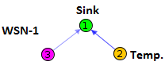
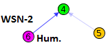
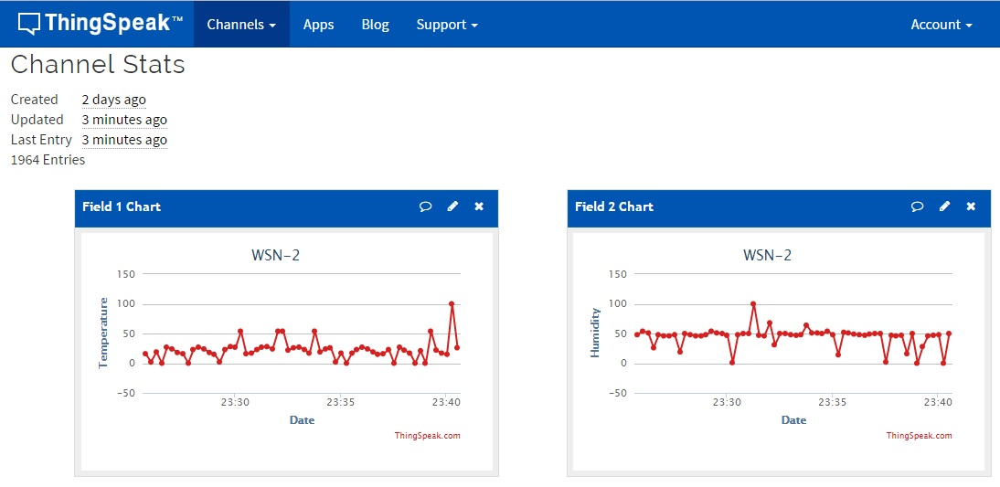
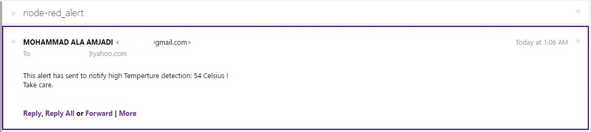
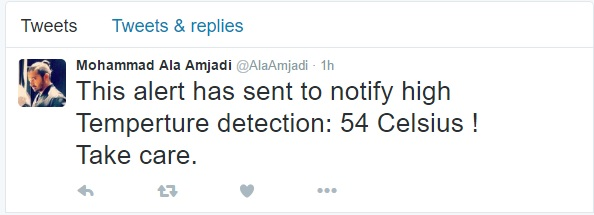

# TinyOS WSN → Node-RED → ThingSpeak (Dual-Channel) — Cooja Simulation

This repository is an end-to-end IoT / WSN demo showing how to:

- simulate **TinyOS TelosB (Sky) motes** in **Cooja**
- stream sensor data over **Serial Socket → TCP**
- parse TinyOS serial frames in **Node-RED**
- publish Temperature/Humidity to **ThingSpeak**
- run **two independent WSN clusters** (“Channel 01” and “Channel 02”) and push each cluster to a different ThingSpeak channel

## Architecture

```
<Channel 01 - Cluster 01>                                                                        <Channel 02 - Cluster 02>
[Temp-1] \                                                                                                / [Temp-2]
          \ (AM RADIO_MSG=6)                                                           (AM RADIO_MSG=6)  /
           \                                                                                            /
[Hum-1]  ---> [Sink-1] --SerialSocket--> TCP :60003                          TCP :60004 <--- [Sink-2] <--SerialSocket-- [Hum-2]
                                          |                                      |
                                          v                 TCP IN               v
                                      |-----------------------------------------------|
                                      |                [Node-RED Flow] ---------------|------> ThingSpeak Channel 01 & 02
                                      |_______________________________________________|
```

> In this implementation, **each cluster has its own Sink mote** and its own Serial Socket TCP port.  
> (See the “Add `cluster_id`” section below if you prefer a single Sink that distinguishes clusters at the packet level.)

## Repository structure

- `TinyOS/`
  - `Temp/` Temperature mote application
  - `Hum/` Humidity mote application
  - `Sink/` Sink mote application
  - `Makefile` Build orchestrator (build all apps at once)
- `Node-RED/flows.json` Node-RED flow export
- `cooja/` Cooja simulation configuration (`*.csc`)
- `screenshots/` screenshots used in this README

## Message formats

### Radio message (Temp/Hum → Sink)

Active Message type: `RADIO_MSG = 6`

```c
typedef nx_struct mag_msg {
  nx_uint8_t  msg_type;  // 1=temp, 2=hum
  nx_uint16_t data;      // raw 16-bit sample
} mag_msg_t;
```

### Serial message (Sink → Node-RED)

Serial AM type: `SERIAL_MSG = 0x89` (decimal `137`)

```c
typedef nx_struct mags_msg {
  nx_uint16_t datat; // temp raw
  nx_uint16_t datah; // hum raw
} mags_msg_t;
```

Node-RED extracts the 4 payload bytes (2 bytes temperature + 2 bytes humidity) and scales them to **0–100**.

## Build the TinyOS applications

Build all apps:

```bash
cd "TinyOS"
make
```

Build individually:

```bash
cd "TinyOS"
make temp
make hum
make sink
```

Clean:

```bash
cd "TinyOS"
make clean
```

## Run the Cooja simulation

1. Open Cooja.
2. Open the simulation file inside `cooja/` (the `*.csc` file).
3. Make sure each mote type points to the correct firmware (e.g., `TinyOS/<APP>/build/telosb/main.exe`).
4. Enable **Serial Socket** for each Sink mote:
   - Sink-1: **port 60003**
   - Sink-2: **port 60004**
5. Start the simulation.

### Cooja Simulation Diagram




## Run Node-RED + ThingSpeak

1. Start Node-RED:
   ```bash
   node-red
   ```
2. Open: `http://localhost:1880`
3. Import the flow:
   - Menu → Import → Clipboard
   - Paste the content of `Node-RED/noderedflows`
4. Update the TCP input ports in the flow (if you changed them in Cooja):
   - Channel 01 listens on **60003**
   - Channel 02 listens on **60004**
5. Configure ThingSpeak:
   - Create **two ThingSpeak channels** (one per WSN cluster).
   - Set **Field 1 = Temperature** and **Field 2 = Humidity**.
   - Copy each channel’s **Write API Key** into the Node-RED flow.

### ThingSpeak write URL pattern

Typical update endpoint:

```
https://api.thingspeak.com/update?api_key=<WRITE_KEY>&field1=<Temperature>&field2=<Humidity>
```

## Screenshots

### Project Diagram


### Node-RED Flow


## ThingSpeak screenshots

### Channel 01


### Channel 02



## Alerts (optional)

If your flow includes alert nodes, you can trigger notifications (email/tweet) based on thresholds.

### Email Alert



### Tweet Alert



---

## Adding `cluster_id` to the radio packet (single-sink alternative)

If you want **one Sink mote** to handle multiple clusters, add a `cluster_id` field to the radio payload.
This lets the Sink (and then Node-RED) know which cluster a sample belongs to.

### Step A — Update the radio message struct

Edit both headers (or the shared header if you unified them):

- `TinyOS/Temp/Magt.h`
- `TinyOS/Hum/Magh.h`

Change:

```c
typedef nx_struct mag_msg {
  nx_uint8_t  msg_type;
  nx_uint16_t data;
} mag_msg_t;
```

To:

```c
typedef nx_struct mag_msg {
  nx_uint8_t  cluster_id; // NEW: 1,2,...
  nx_uint8_t  msg_type;   // 1=temp, 2=hum
  nx_uint16_t data;       // raw sample
} mag_msg_t;
```

> This increases the payload by 1 byte. If you have any hard-coded payload-length assumptions, update them accordingly.

### Step B — Set the cluster ID in each mote

In:

- `TinyOS/Temp/MagtC.nc`
- `TinyOS/Hum/MaghC.nc`

Add a constant at the top of each app:

```c
enum { CLUSTER_ID = 1 }; // for cluster 01
// enum { CLUSTER_ID = 2 }; // for cluster 02
```

Then, before sending:

```c
mag_msg_t* pkt = (mag_msg_t*) call Packet.getPayload(&packet, sizeof(mag_msg_t));
pkt->cluster_id = CLUSTER_ID;
pkt->msg_type   = MSG_TYPE_TEMP; // or MSG_TYPE_HUM
pkt->data       = sample;
```

### Step C — Read `cluster_id` in the Sink

In `TinyOS/Sink/MagsC.nc`, when you receive a radio packet, cast to `mag_msg_t` and branch:

```c
mag_msg_t* in = (mag_msg_t*) payload;

if (in->cluster_id == 1) {
  // store cluster01 temp/hum
} else if (in->cluster_id == 2) {
  // store cluster02 temp/hum
}
```

### Step D — Forward `cluster_id` to Node-RED (recommended)

If Node-RED must route to different ThingSpeak channels, include `cluster_id` in the **serial** message too.

Edit `TinyOS/Sink/Mags.h`:

```c
typedef nx_struct mags_msg {
  nx_uint8_t  cluster_id; // NEW
  nx_uint16_t datat;
  nx_uint16_t datah;
} mags_msg_t;
```

Then update the Sink serial-send logic and update the Node-RED parser:

- extract `cluster_id`
- route to TS Channel 01/02 based on it

> With this approach, you can run **one Sink** and keep **one TCP port**.

---

## Common tweaks

- **Dataset size**: `TinyOS/*/DATA/*.h` contains fixed datasets for simulation.
  - If you replace values, keep `*_DATA_SIZE` aligned with the number of samples.
- **Ports**: If you change Serial Socket ports in Cooja, update the TCP-IN nodes in Node-RED.
- **Credentials**: Email/Twitter nodes require your own credentials (the repo ships with placeholders).

---

## License

See `LICENSE`.
